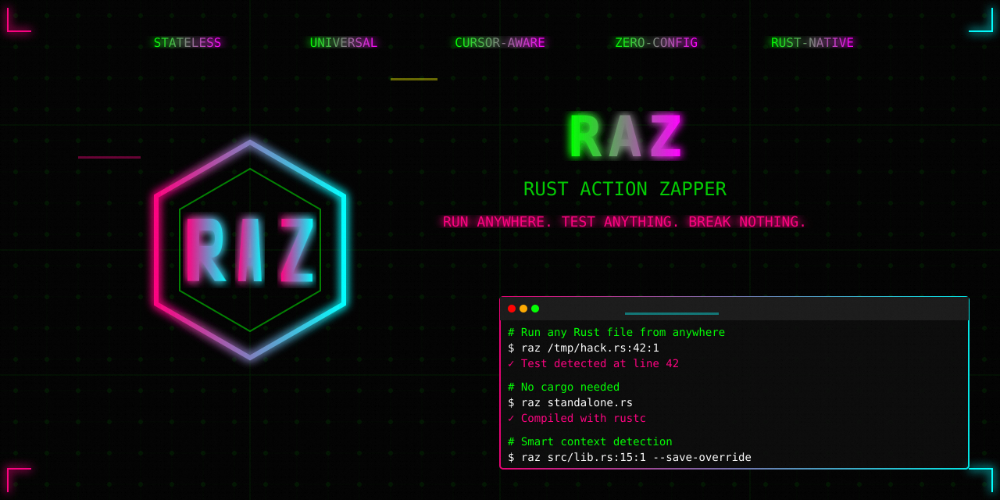

# RAZ - Rust Action Zapper

**Universal command runner for Rust - Run any Rust file from anywhere with smart test detection**

[Installation](#installation) • [Quick Start](#quick-start) • [Documentation](docs/) • [VS Code Extension](raz-adapters/vscode/README.md)

## What is RAZ?

RAZ is a universal command runner that executes any Rust file from any directory without requiring workspace context. It provides intelligent, cursor-aware test detection and persistent command overrides.

## Why RAZ?

**Without RAZ**: Remember and retype complex cargo commands, navigate to project directories, manually manage test flags

**With RAZ**: Run any file from anywhere, save working configurations automatically, never lose your test setup

### Core Features

- 🎯 **Universal Execution** - Run any Rust file from anywhere without `cd`ing into directories
- 📍 **Cursor-Aware Detection** - Automatically detects and runs the test/function at your cursor position
- 💾 **Smart Override System** - Save command flags per function, only persisted after successful execution
- 🛡️ **Deferred Save** - Failed commands never save bad configurations
- 🔧 **IDE Integration** - Works with VS Code, Vim, IntelliJ, and any editor
- 🚀 **Zero Configuration** - Works instantly with any Rust project structure

## Key Concepts

### Universal Execution
RAZ can run any Rust file from any directory without requiring workspace context:
- Run files from `/tmp/` or any random location
- Execute tests without being in the project root
- Work with multiple projects simultaneously

### Smart Context Detection
RAZ analyzes your Rust files to determine:
- File type (binary, library, test, example, etc.)
- Module structure for accurate test targeting
- Framework detection (Leptos, Dioxus, Tauri, etc.)
- Entry points (main functions, tests, benchmarks)

### Override Persistence with Deferred Save
Save command configurations per function - only working overrides are saved:
- Override data prepared but not saved immediately
- Command executed with the override applied
- Only if command succeeds is override saved to config
- Failed commands leave no persistent configuration

### Intelligent Validation
RAZ provides smart validation for command-line options:
- Context-aware validation (knows which options work with which commands)
- Framework-specific option support
- Helpful error messages with suggestions
- Configurable validation levels
## Available Adapters

RAZ works across multiple environments:

- **[CLI](raz-adapters/cli/README.md)**  - Command-line interface
- **[VS Code Extension](raz-adapters/vscode/README.md)**  - IDE integration with hotkeys
- **[Vim/Neovim](raz-adapters/vim/README.md)** - Terminal and editor integration
- **More coming soon** - IntelliJ and other editors

## Architecture

| Component | Description |
|-----------|-------------|
| [`raz-core`](raz-core/)  | Core command generation and execution engine |
| [`raz-validation`](raz-validation/)  | Framework-aware smart options validation |
| [`raz-override`](raz-override/)  | Persistent override management with deferred save |
| [`raz-config`](raz-config/)  | Configuration and settings management |
| [`raz-common`](raz-common/)  | Shared utilities and types |

## Documentation

- **[Release Scripts](scripts/README.md)** - Automated release process and scripts
- **[Contributing Guide](CONTRIBUTING.md)** - Development setup and guidelines

## Contributing

See [CONTRIBUTING.md](CONTRIBUTING.md) for development setup and guidelines.

## License

MIT - see [LICENSE](LICENSE) for details.

---

**The universal command runner for Rust** 🦀⚡

[Report Bug](https://github.com/codeitlikemiley/raz/issues) • [Request Feature](https://github.com/codeitlikemiley/raz/issues) • [Full Documentation](docs/)

